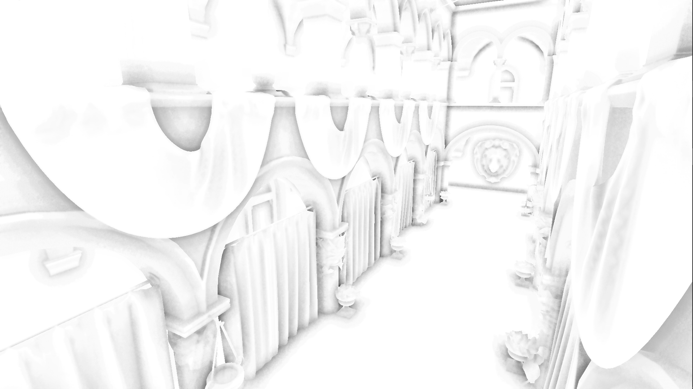

Temporal SSAO for Unity

My implementation of temporal SSAO. This image is rendered with my 940MX with around 6 ms, on 1080p. 3 sample per pixel per frame.

The SSAO itself is based on the Scalable Ambient Obscurance by Morgan McGuire, minus the mip-mapping part. (Will do it in the future, probably)

The temporal sampling part is based on the paper by Oliver Mattausch.

The final blending shader is from keijiro/MiniEngineAO.